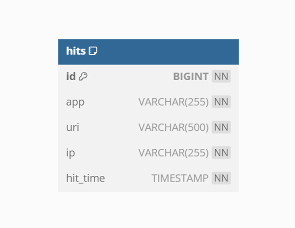

<h1 align="center"> ExploreWithMe </h1>

____

ExploreWithMe (англ. «исследуй со мной») - приложение, которое позволит пользователям делиться информацией об интересных событиях и находить компанию для участия в них.

___
### Технологический стек проекта: 
- Java 11 
- Spring Boot
- Apache Maven
- Hibernate
- Lombok
- PostgreSQL
- Docker
- RabbitMQ

Валидация данных в приложении осуществлялась при помощи аннотаций из пакета *javax.validation* для полей DTO-классов, параметров методов контроллеров, валидационных методов при помощи аннотации `@AssertTrue` для проверки сложных условий, а также при помощи собственных кастомных аннотаций.
___
### Приложение состоит из **двух модулей**:
1.	*Основной сервис* - содержит всё необходимое для работы продукта.
2.	*Сервис статистики* - хранит количество просмотров событий и позволяет делать различные выборки для анализа работы приложения и составления рейтинга наиболее просматриваемых событий.

Оба сервиса разрабатывались на основе *Swagger* спецификации API:
- спецификация основного сервиса: [ewm-main-service-spec.json](https://raw.githubusercontent.com/yandex-praktikum/java-explore-with-me/main/ewm-main-service-spec.json);
- спецификация сервиса статистики: [ewm-stats-service.json](https://raw.githubusercontent.com/yandex-praktikum/java-explore-with-me/main/ewm-stats-service-spec.json).
____
### API основного сервиса разделено на три части:
- **публичная** — доступна любому пользователю сети;
- **закрытая** — доступна только авторизованным пользователям;
- **административная** — для администраторов сервиса.

Помимо основной части, предусмотренной в спецификации, также была реализована дополнительная функциональность – комментарии к событиям, включающая основные CRUD операции, а также различные способы получения комментариев с различными параметрами фильтрации.

#### Жизненный цикл события состоит из нескольких этапов:
1.	*Создание*.
2.	*Ожидание публикации*. В статус ожидания публикации событие переходит сразу после создания.
3.	*Публикация*. В это состояние событие переводит администратор.
4.	*Отмена публикации*. В это состояние событие переходит в двух случаях. Первый — если администратор решил, что его нельзя публиковать. Второй — когда инициатор события решил отменить его на этапе ожидания публикации.

*Схема базы данных основного сервиса*

____
### Сервис статистики

Второй сервис — сервис статистики. Он собирает информацию о количестве обращений пользователей к спискам событий и о количестве запросов к подробной информации о событии. На основе этой информации формируется статистика о работе приложения и рейтинг наиболее просматриваемых событий.

Функционал сервиса статистики содержит:
- запись информации о том, что был обработан запрос к эндпоинту API основного сервиса;
- предоставление статистики за выбранные даты по выбранному эндпоинту с возможностью учета только просмотров от уникальных пользователей.

*Схема базы данных сервиса статистики*

____
Взаимодействие между сервисами реализовано двумя способами:
1.	Через HTTP клиент (`RestTemplate`) – ветка *main*;
2.	Через программный брокер сообщений (`RabbitMQ`) – ветка *add_rabbitmq*.

На данном этапе тестирование приложения проводилось при помощи *Postman* – коллекций, расположенных в папке postman проекта.

____ 

Предполагается, что с внешним миром сервисы связывает сетевой шлюз. Он контактирует с системой аутентификации и авторизации, а затем перенаправляет запрос в сервисы. Реализация такого шлюза, а также системы аутентификации и авторизации является следующим планируемым этапом развития данного проекта. Также планируется добавление модульных и интеграционных тестов.